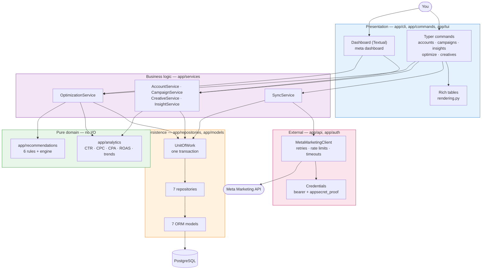

# meta-optimizer

A CLI that pulls your Meta advertising data into PostgreSQL, analyses it, and recommends what to fix. Everything runs in Docker, no Python needed.

## Setup

```bash
# 1. Check Docker works
docker --version

# 2. Go to the project folder
cd /path/to/ad-optimizer

# 3. Create your config file, then fill in the four META_* values
cp .env.example .env

# 4. Build the image
docker compose build

# 5. Start the database and app container in the background
docker compose up -d

# 6. Confirm both containers are running
docker compose ps

# 7. Create the database tables
docker compose run --rm app alembic upgrade head

# 8. Pull your data from Meta (run in this order the first time)
docker compose run --rm app meta accounts --sync
docker compose run --rm app meta campaigns --sync
docker compose run --rm app meta insights --sync --days 14

# 9. Get your recommendations (changes nothing in your account)
docker compose run --rm app meta optimize --sync --detail

# 10. Apply one recommendation by its ID
docker compose run --rm app meta optimize --apply 42

# 11. Stop when finished (your data survives)
docker compose down
```

## Command reference

```bash
# Stack
docker compose up -d                         # Start the stack
docker compose down                          # Stop the stack
docker compose down -v                       # Stop and delete all data
docker compose ps                            # Show what is running
docker compose logs -f app                   # Follow app logs
docker compose restart app                   # Restart the app service
docker compose exec app bash                 # Open a shell in the container

# CLI
docker compose run --rm app meta --help                      # List commands
docker compose run --rm app meta accounts --sync             # List ad accounts
docker compose run --rm app meta campaigns --status active   # List campaigns
docker compose run --rm app meta insights --level adset --days 30   # Performance report
docker compose run --rm app meta optimize --open             # Show open recommendations
docker compose run --rm app meta creatives --in-use          # List creatives in use

# Interactive dashboard (full-screen TUI; needs a terminal)
docker compose run --rm -it app meta dashboard               # Open the dashboard

# Database
docker compose run --rm app alembic upgrade head             # Apply migrations
docker compose run --rm app alembic current                  # Show current migration
docker compose run --rm app alembic downgrade -1             # Roll back last migration
docker compose exec postgres psql -U meta -d meta_optimizer  # Open a psql session

# Tests and quality checks
docker compose run --rm app pytest                           # Run the test suite
docker compose run --rm app pytest -k "creative_fatigue"     # Run matching tests
docker compose run --rm app ruff check app/ tests/           # Lint
docker compose run --rm app black app/ tests/                # Format
docker compose run --rm app mypy app/ tests/                 # Type-check

# Build production image
docker build -f docker/Dockerfile --target runtime -t meta-optimizer:latest .   # Leaner runtime image

# When something goes wrong
docker compose build --no-cache              # Rebuild ignoring the cache
docker compose config                        # Show the resolved config
docker compose exec postgres pg_isready -U meta   # Check the database is reachable
```

## The commands

| Command | What it does |
|---|---|
| `meta accounts` | List the ad accounts your token can reach |
| `meta campaigns` | List campaigns, with budgets and status |
| `meta insights` | Performance report, each period compared to the one before |
| `meta optimize` | Generate recommendations — and optionally apply them |
| `meta creatives` | List your creative library, with how widely each is used |
| `meta dashboard` | Open an interactive full-screen dashboard over all of the above |

Every command reads from the local database by default. Add `--sync` to fetch fresh data from Meta first.

### Dashboard

`meta dashboard` is a terminal UI with tabs for findings, campaigns, performance, and creatives. Because it is full-screen, run it with an interactive terminal (`-it`):

```bash
docker compose run --rm -it app meta dashboard
```

Keys: `r` reload · `a` apply the highlighted finding · `d` dismiss it · `q` quit.

## Architecture

The project is built in layers, and dependencies only ever point **downward**. A command never touches the database; a repository never makes an HTTP call. The CLI and the TUI are two presentation surfaces over the same services.



The analytics and rules layers are pure functions with no I/O, which is why a rule can be tested with a literal — no database, no network — and why an LLM-backed rule could replace the rule engine without changing anything above or below it.

## Configuration

Four required environment variables in `.env`:

| Variable | What it is |
|---|---|
| `META_ACCESS_TOKEN` | Your Meta API token (`ads_read`, plus `ads_management` to apply changes) |
| `META_APP_ID` | Numeric app ID the token was issued for |
| `META_APP_SECRET` | App secret, used to sign requests |
| `META_AD_ACCOUNT_ID` | Default account, including the `act_` prefix |

## License

MIT
